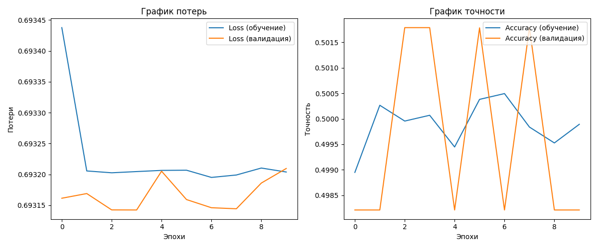

# Security_AI


## Цель работы:

Обеспечение информационной безопасности в компьютерной сети за счет использования алгоритмов машинного обучения.

## Содержание

- [Описание](#описание)
- [Библиотеки](#библиотеки)
- [Данные](#данные)
- [Использование](#использование)
- [Примеры](#примеры)
- [Тестирование](#тестирование)
- [Установка](#установка)

## Описание

В данном проекте была разработана мини-модель искусственного интеллекта (ИИ), предназначенная для оказания помощи сотрудникам информационной безопасности. С учетом увеличения числа киберугроз, необходимость в эффективных инструментах анализа и реагирования становится все более актуальной. Проект направлен на автоматизацию процессов анализа сетевого трафика, проверки хешей файлов, анализа файлов на наличие вредоносного кода и выполнения сетевой безопасности.
Проект реализован на языке программирования Python, который является одним из самых популярных языков для разработки приложений в области машинного обучения и анализа данных благодаря своей простоте и мощным библиотекам.

## Библиотеки

*	**Transformers**: библиотека от Hugging Face, используемая для работы с предобученными языковыми моделями, такими как BERT и RoBERTa. Она позволяет легко интегрировать модели для обработки естественного языка (NLP).

*	**Pandas**: библиотека для работы с данными, предоставляющая удобные структуры данных и инструменты для анализа.

*	**Scikit-learn**: библиотека для машинного обучения, использующаяся для разделения данных на обучающие и тестовые наборы, а также для других операций, связанных с подготовкой данных.

* **Requests**: библиотека для выполнения HTTP-запросов, используемая для взаимодействия с внешними API, такими как VirusTotal и Shodan.

*	**Nmap**: инструмент для сетевого сканирования, используемый для анализа открытых портов и служб на целевых машинах.

*	**Shodan**: поисковая система для интернета вещей (IoT), позволяющая находить устройства и их уязвимости.

### В проекте используются два основных набора данных:

*	**Payload_data_CICIDS2017.csv**: этот набор данных содержит информацию о сетевом трафике, включая байты полезной нагрузки, TTL (Time to Live), общую длину пакета, протокол и метку (label), указывающую на тип трафика (например, нормальный или атакующий). Данные из этого набора используются для обучения модели, которая будет классифицировать сетевой трафик и выявлять потенциальные угрозы.


## Данные

### График данных базы


### График оценки точности и ошибочности модели


### График целостности данных


### Пример обучения модели



```bash

Epoch 1/10
32457/32457 ━━━━━━━━━━━━━━━━━━━━ 62s 2ms/step - accuracy: 0.4981 - loss: 0.6943 - val_accuracy: 0.4982 - val_loss: 0.6932
Epoch 2/10
32457/32457 ━━━━━━━━━━━━━━━━━━━━ 39s 1ms/step - accuracy: 0.5002 - loss: 0.6932 - val_accuracy: 0.4982 - val_loss: 0.6932
Epoch 3/10
32457/32457 ━━━━━━━━━━━━━━━━━━━━ 38s 1ms/step - accuracy: 0.5003 - loss: 0.6932 - val_accuracy: 0.5018 - val_loss: 0.6931
Epoch 4/10
32457/32457 ━━━━━━━━━━━━━━━━━━━━ 42s 1ms/step - accuracy: 0.5012 - loss: 0.6932 - val_accuracy: 0.5018 - val_loss: 0.6931
Epoch 5/10
32457/32457 ━━━━━━━━━━━━━━━━━━━━ 43s 1ms/step - accuracy: 0.4992 - loss: 0.6932 - val_accuracy: 0.4982 - val_loss: 0.6932
Epoch 6/10
32457/32457 ━━━━━━━━━━━━━━━━━━━━ 46s 1ms/step - accuracy: 0.5011 - loss: 0.6932 - val_accuracy: 0.5018 - val_loss: 0.6932
Epoch 7/10
32457/32457 ━━━━━━━━━━━━━━━━━━━━ 64s 2ms/step - accuracy: 0.5002 - loss: 0.6932 - val_accuracy: 0.4982 - val_loss: 0.6931
Epoch 8/10
32457/32457 ━━━━━━━━━━━━━━━━━━━━ 58s 2ms/step - accuracy: 0.4994 - loss: 0.6932 - val_accuracy: 0.5018 - val_loss: 0.6931
Epoch 9/10
32457/32457 ━━━━━━━━━━━━━━━━━━━━ 49s 2ms/step - accuracy: 0.4995 - loss: 0.6932 - val_accuracy: 0.4982 - val_loss: 0.6932
Epoch 10/10
32457/32457 ━━━━━━━━━━━━━━━━━━━━ 58s 2ms/step - accuracy: 0.5003 - loss: 0.6932 - val_accuracy: 0.4982 - val_loss: 0.6932
8115/8115 ━━━━━━━━━━━━━━━━━━━━ 8s 943us/step - accuracy: 0.4987 - loss: 0.6932
Точность на тестовой выборке: 49.82%

```

## Использование

### Интерактивный режим:

После запуска приложения вы перейдете в интерактивный режим, где сможете вводить команды.
Для получения справки по доступным командам введите help.
Доступные команды:

#### 1) question: Задать вопрос по безопасности.
Вводите вопрос, связанный с безопасностью, и получайте ответ от AI-консультанта по безопасности.

#### 2) file: Выполнить анализ файла.
Укажите путь к файлу, и программа выполнит его анализ, предоставляя результаты, такие как наличие вредоносного кода или уязвимостей.

#### 3) network: Провести анализ сети.
Вводите IP-адрес или доменное имя для проверки репутации сети и сканирования на уязвимости. Программа предоставит информацию о репутации и возможных уязвимостях.

#### 4) train: Обучить модель на основе предоставленного набора данных.
Укажите путь к набору данных, и программа обучит модель на основе предоставленных данных. Это может быть полезно для улучшения алгоритмов безопасности.
(Изначально программа имеет набор данных для обучения и может предоставить определенный вид реализации данного набора данных)

#### 5) exit: Выйти из приложения.

## Тестирование 

В файлах программы уже имеются набор тестов для проверки работы классов и их функций

## Установка

Инструкции по установке проекта. Например:
```bash
git clone https://github.com/David2287/Security_AI.git

pip install -r Security_AI/requirements.txt
```

```http request
https://clck.ru/3FGWHh
```
